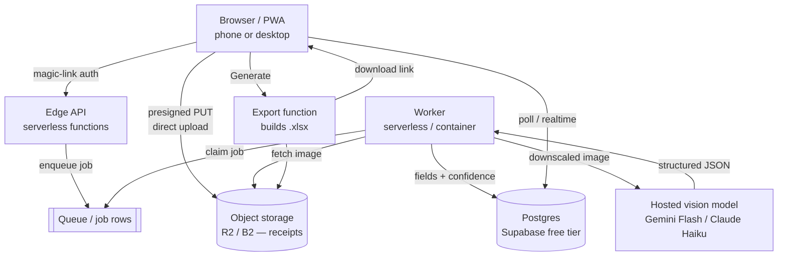

# Designing This App From Scratch — A Cost-First, Ease-of-Use-First Rewrite

> **Scope of this document.** This is a *design* note, not a spec for the current
> code. It answers one question: **if I rebuilt the receipt → reimbursement-report
> app today, with different priorities, how would I design and program it?**
>
> The current app (`BLUEPRINT.md`) optimizes for **privacy** and **local-only**
> operation — you run it on your own machine and point it at a local LM Studio
> model so *no receipt data ever leaves the box*. That is a deliberate, valuable
> constraint, and it shapes everything: Python + FastAPI, RapidOCR on
> `onnxruntime`, Docker, "bring your own GPU."
>
> Here the priorities flip:
>
> | Priority | Current app | This rewrite |
> |---|---|---|
> | **No-to-low cost** | secondary | **primary driver** |
> | **Ease of use** | good, but needs Docker + a local model | **primary driver** |
> | Privacy | non-negotiable | nice-to-have, not required |
> | Local-only | required | not required (cloud is allowed) |

Dropping the "local-only" and "privacy-absolute" constraints is what *unlocks*
the other two goals: we can use a cheap hosted vision model (no GPU, no
install) and a zero-setup web app (no Docker). The whole design below falls out
of that one trade.

---

## 1. Goals & non-goals

**Goals (in priority order)**
1. **Cheap to run** — ideally **$0 at rest** and **single-digit dollars/month**
   at light real use. Scale-to-zero everywhere; pay only per receipt processed.
2. **Trivial to use** — open a URL, drag in (or photograph) receipts, click
   *Download*. No install, no Docker, no model setup, works on a phone.
3. **Accurate enough to trust** — keep the parts of the current pipeline that
   make extraction reliable (image cleanup, amount reconciliation, confidence,
   dedup, human review).
4. **Polished output** — the multi-sheet Excel workbook is still the product.

**Non-goals**
- Absolute privacy / on-device inference (we accept sending images to a hosted
  model — see §9 for the responsible-handling guardrails we keep anyway).
- Running entirely offline.
- Self-hosting a GPU or a local LLM.

---

## 2. Guiding principles

- **Scale to zero.** Every component should cost nothing when idle. That rules
  out always-on VMs as the default and favors serverless + object storage +
  managed free-tier data stores.
- **The model is the only variable cost — so spend tokens carefully.** Downscale
  and pre-process images *before* the model sees them, use the cheapest vision
  model that clears the accuracy bar, and cache aggressively.
- **Zero-config beats configurable.** Sensible defaults over settings screens.
  The current app's many env knobs become internal constants with a tiny
  "Advanced" drawer.
- **Mobile-first capture.** Most receipts start as a phone photo; the happy path
  is "snap → upload → done," installable as a PWA.
- **Boring, managed building blocks.** Prefer a managed Postgres + object store
  with generous free tiers over anything we have to operate.

---

## 3. High-level architecture



**Why this shape**

- **Direct-to-storage uploads (presigned URLs).** The image bytes go straight
  from the browser to object storage, never through our functions. This is the
  single biggest cost/scaling win — function invocations stay tiny and cheap,
  and big uploads can't blow a function's memory or request-size limit.
- **A worker decoupled by a job table/queue.** Vision calls take seconds; we
  don't want the user's request blocked on them, and we want natural retry,
  backpressure, and per-user rate limiting. A row in a `jobs` table *is* the
  queue for the cheap tier (poll with `SELECT … FOR UPDATE SKIP LOCKED`); graduate
  to a real queue (Cloudflare Queues, SQS) only if volume demands.
- **Read path is just the database.** The browser shows live status by
  polling (or a managed realtime channel). No long-lived SSE connection to keep
  a server warm — which matters because *keeping a server warm costs money*.

---

## 4. Recommended stack (and the rationale)

| Layer | Recommended | Why | Cheaper / alt |
|---|---|---|---|
| **Frontend** | SvelteKit (or plain Vite SPA) as a **static** site on **Cloudflare Pages** | Free static hosting + global CDN; tiny JS; no server to keep warm | Vercel/Netlify free tier; or keep the current single-file vanilla SPA |
| **API + worker** | **Cloudflare Workers** (+ Workers Queues/Cron) | True scale-to-zero, generous free tier, no cold-VM bill, runs at the edge | Vercel/Netlify functions; Fly.io / Render free instance; Supabase Edge Functions |
| **Object storage** | **Cloudflare R2** | S3-compatible, **zero egress fees**, ~10 GB free | Backblaze B2; Supabase Storage |
| **Database** | **Supabase Postgres** (free tier) | Managed Postgres + Auth + Realtime + Storage in one free project | Neon/Turso; Cloudflare D1 |
| **Auth** | Supabase Auth **magic links** / Google OAuth | Passwordless = easiest UX; no password storage | Clerk free tier |
| **Vision model** | **Gemini Flash-Lite/Flash** as default; **Claude Haiku 4.5** as the quality tier | Cheapest capable vision models; both have strong receipt OCR | Any OpenAI-compatible cheap vision model; self-hosted only if volume justifies |
| **OCR fallback** | **Tesseract.js in the browser** (optional) | Runs free on the client; gives a cheap text cross-check and an offline-ish path | A cheap OCR API only if needed |
| **Spreadsheet** | **ExcelJS** (Node) | Mature XLSX builder; matches what `spreadsheet_theme.py` does today | SheetJS |

**One-paragraph summary:** *Static SvelteKit on Cloudflare Pages, Cloudflare
Workers for the API and the background worker, R2 for images, Supabase for
Postgres + Auth + (optional) Realtime, and Gemini Flash as the default extractor
with Claude Haiku as the accuracy upgrade.* Every piece has a real free tier and
scales to zero; the only usage-priced thing is the model call.

> **Language note.** I'd write the new system in **TypeScript end-to-end** rather
> than Python. Not because Python is worse, but because one language across the
> static frontend, the edge API, and the worker means one toolchain, one set of
> types shared between client and server, and direct deployment to the cheapest
> serverless runtimes (Workers/edge) without a container. That directly serves
> the "low cost + easy" goals. (If we wanted to *reuse* the current Python
> pipeline wholesale, a small FastAPI worker on Fly.io/Render is a fine
> alternative — but it's an always-on-ish box, i.e. a small fixed monthly cost.)

---

## 5. The processing pipeline (cloud-adapted)

The current pipeline is genuinely good; most of it ports directly. The big
change: **one cheap hosted vision model replaces "local OCR + local distill +
local vision rescue,"** because a modern vision LLM reads the receipt *and*
extracts structured fields in a single call — which is both cheaper (one call)
and simpler than the multi-stage local dance.

Per receipt, the worker does:

1. **Normalize the image (free, client- or worker-side).** Auto-rotate from EXIF,
   optional grayscale, **auto-crop** the background, and **downscale to ~1500 px
   on the long edge**. Downscaling is now a *cost* lever, not just a quality one:
   fewer pixels → fewer image tokens → cheaper call. (Do this in the browser when
   possible so we upload smaller files too.)
2. **One structured-extraction call** to the vision model with a strict JSON
   schema (vendor, date, amount, tax, category, line items, currency,
   confidence, flags). Use the provider's JSON/structured-output mode so we don't
   hand-parse free text. Temperature 0.
3. **Ground the numbers in rules, not the model.** Keep the current
   **amount-reconciliation** idea: re-find the printed grand total with a regex
   and prefer it over the model's number when they disagree. Cheap models
   fat-finger totals; rules fix that for free.
4. **Classify + confidence + dedup** — port the current `vendor_db`
   category lookup, confidence scoring, and duplicate detection (same vendor +
   date + amount). All free, all deterministic.
5. **Optional free cross-check.** If we ran Tesseract.js in the browser, feed its
   text alongside the image so the model can cross-reference — the current
   "dual-OCR cross-reference" trick, but with the free engine on the client.

**Cost controls baked into the pipeline**
- Downscale before upload (§5.1).
- **Content hash → cache.** Hash the normalized image; if we've extracted that
  exact image before (re-uploads, retries), return the cached result for $0.
- **Cheap model first, escalate on low confidence.** Run Gemini Flash-Lite by
  default; only re-run a *low-confidence* receipt on the pricier Claude Haiku.
  Most receipts never hit the expensive path.
- **Per-user quotas / rate limits** so a runaway loop or abuse can't run up a bill
  (see §9).

---

## 6. Data model (minimal)

```
users(id, email, created_at)
batches(id, user_id, employee, job_name, job_number, created_at)
receipts(
  id, batch_id, user_id,
  storage_key,            -- R2 object key for the original
  status,                 -- queued | processing | done | failed | needs_review
  image_hash,             -- for the extraction cache
  vendor, date, amount, tax, currency, category,
  confidence, flags jsonb,
  model_used, cost_cents, -- per-receipt cost for transparency + quotas
  approved bool, review_required bool,
  created_at, updated_at
)
jobs(id, receipt_id, attempts, locked_at, locked_by)   -- the cheap "queue"
```

`receipts` *is* the kanban board, the results store, and the export source — the
browser just queries it. `cost_cents` per row makes the per-user quota and a
"this batch cost you 4¢" UI trivial, which is great for trust and for capping
spend.

---

## 7. Key user flows

**Upload (zero friction)**
1. User drops/snaps receipts. The client downscales each image locally.
2. Client asks the API for a **presigned PUT** per file and uploads **directly to
   R2**. The API only records `receipts` rows + enqueues `jobs`. Fast and cheap.

**Process (decoupled)**
3. The worker (a Cron-triggered Worker, or a queue consumer) claims jobs with
   `FOR UPDATE SKIP LOCKED`, runs the §5 pipeline, writes results, retries with
   backoff on failure, and marks `needs_review` when confidence is low.

**Review (the trust step — keep it)**
4. The browser polls (or subscribes to Supabase Realtime) and renders the same
   **kanban + review modal** the current app has, including the keyboard-driven
   *Approve & Next* sweep and on-image field markup. This UX is a strength;
   port it.

**Export (on demand)**
5. *Generate* calls an export function that builds the themed `.xlsx` with
   ExcelJS (Summary form, Insights charts, per-category image sheets, conditional
   formatting), writes it to R2, and returns a short-lived signed download URL.
   Images are pulled from R2 and compressed **at export time** — keep the
   current "deferred compression" rule so extraction always reads full-res.

---

## 8. Cost model (back-of-envelope)

The point of the architecture is that **fixed cost ≈ $0** and **variable cost ≈
the model call**, so the bill scales with actual use.

- **Hosting / storage / DB / auth:** $0 on free tiers for a personal-to-small-team
  load (Cloudflare Pages + Workers + R2, Supabase free). Egress on R2 is free,
  which kills the usual "images are expensive to serve" problem.
- **Per receipt:** one downscaled image ≈ a few hundred to ~1.5k input tokens +
  a small JSON output on a *Flash-class* model. On the cheapest current vision
  models that lands around **a fraction of a cent per receipt**; the
  low-confidence escalation to a Haiku-class model is a few cents and rare.
- **Illustrative:** ~1,000 receipts/month with most on the cheap model is
  realistically **well under ~$5/month**, and **$0 in any month you don't use
  it**. (Always re-check current model pricing — it moves, generally downward.)

Levers if cost ever matters: downscale harder, cache by image hash, batch where
the provider supports it, and keep the free in-browser OCR doing as much as it
can before paying for a model call.

---

## 9. We dropped "privacy as a must" — but not "be responsible"

Privacy isn't a hard requirement here, but a finance app still shouldn't be
careless, and a few cheap guardrails *also* protect us from runaway cost:

- **Use providers with a no-training / zero-retention posture** for API data, and
  say so plainly in the UI. "Not local" shouldn't mean "your receipts train a
  model."
- **Don't keep what we don't need.** Offer auto-delete of original images after
  successful export (the structured row is what matters). Less storage = less
  cost *and* less exposure.
- **Per-user spend quotas + rate limits + upload caps** (size, count, type). This
  is the single most important non-feature: it turns "someone scripts a million
  uploads" from a surprise invoice into a polite 429.
- **Signed, expiring URLs** for every object; **scoped auth** so users only see
  their own `receipts`.
- **Carry over the current app's input hardening** — basename-only filenames,
  zip-slip/zip-bomb caps, reject non-finite amounts, symlink-safe serving. Those
  bugs are platform-independent.

---

## 10. Build plan / milestones

1. **Walking skeleton (½–1 day).** Static SPA → presigned upload to R2 → one
   Worker that calls the vision model on a single image and prints JSON. Proves
   the cheapest end-to-end path works.
2. **MVP (the "it's useful" cut).** Auth (magic link), `receipts`/`jobs` tables,
   the worker pipeline (normalize → extract → reconcile → confidence), a basic
   board with polling, and ExcelJS export. No settings screen.
3. **Trust layer.** Review modal + approve sweep, dedup, on-image field markup,
   per-user cost display + quotas.
4. **Polish.** PWA/installable, the themed multi-sheet workbook, insights charts,
   image-hash caching, low-confidence model escalation, optional auto-delete.
5. **Only if needed.** Real queue, batch endpoints, team accounts, scheduled
   email delivery (port the current `scheduler.py`/`watch_mode.py` ideas).

---

## 11. Trade-offs I'm explicitly accepting

- **Vendor reliance for cost.** Free tiers and cheap models are the whole
  strategy; if a provider changes pricing, costs move. Mitigation: keep the model
  call behind one adapter interface so swapping Gemini ↔ Claude ↔ other is a
  config change, not a rewrite.
- **Network dependency.** No offline mode (the current app's offline regex
  fallback becomes a *nice-to-have*, runnable in-browser, not a core path).
- **Live updates via polling, not SSE.** Slightly less elegant than the current
  SSE board, but it lets the whole backend scale to zero — which is the point.
- **Less-than-absolute privacy.** Accepted by the brief; softened by §9.

---

## 12. What I'd port straight over from today's codebase

The current implementation has earned its good ideas; a rewrite should *steal*
these rather than reinvent them:

- The **image pre-pass** (auto-rotate → grayscale → **auto-crop** → downscale) —
  now doubling as a cost lever.
- **Amount reconciliation** against the printed total, **confidence scoring**, the
  **vendor→category DB**, and **duplicate detection**. All deterministic, all free.
- The **review UX**: kanban board, the review modal, the keyboard *Approve & Next*
  sweep, and on-image field-markup overlays.
- **Deferred, export-time image compression** so extraction always reads the
  sharpest image.
- The **themed multi-sheet workbook** design from `spreadsheet_theme.py`.
- The **input-hardening** safeguards (filename/zip/amount/symlink guards).

---

### TL;DR

Flip two constraints (no longer local-only, no longer privacy-absolute) and the
cheapest, easiest design writes itself: a **static web app + scale-to-zero edge
functions + object storage + a managed free-tier database**, with **one cheap
hosted vision model** doing read-and-extract in a single call. Fixed cost rounds
to **$0**; you pay a fraction of a cent per receipt only when you actually use
it; and the user just opens a link and drags in photos. Keep the current app's
hard-won pipeline smarts and review UX — change *where the model runs and how the
app is delivered*, not *how a receipt is understood*.
