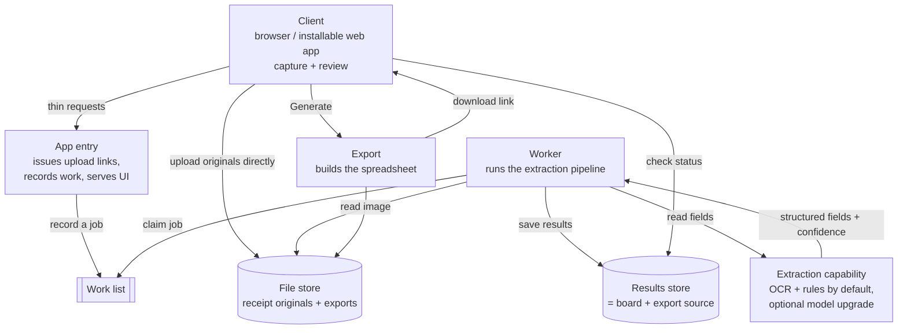

# Designing This App From Scratch — Outcome First, Cheap and Easy

> **Scope of this document.** This is a *design* note, not a spec for the current
> code. It answers one question: **if I rebuilt the receipt → reimbursement-report
> app today, with different priorities, how would I design it?**
>
> The current app (`BLUEPRINT.md`) optimizes for **privacy** and **local-only**
> operation — you run it on your own machine and point it at a local model so *no
> receipt data ever leaves the box*. That is a deliberate, valuable constraint,
> and it shapes everything about the current build.
>
> Here the priorities are different and deliberately short:
>
> 1. **The end result** — turn a pile of receipts into a correct, polished
>    reimbursement spreadsheet.
> 2. **Ease of use** — anyone can do it with no setup.
> 3. **Low / no cost** — ~$0 at rest, pennies in use.
>
> Everything else is optional. Privacy is *not* a hard requirement. Running
> locally is *not* required. Using an LLM is *not* required.

### No technology mandates

This document does **not** require any particular programming language, runtime,
framework, packaging method (no Docker requirement, no "you must use X"), or AI
model. Those are **implementation decisions I would make from the goals above**,
and I record the decisions and the reasoning here — but they are means to the
end and are kept swappable behind clear seams. If a goal can be met two ways, I
pick the one that is cheaper and easier, and I note where the choice could differ
without changing the product.

So: read every concrete technology below as *"a reasonable choice I'd make, for
these reasons,"* not as *"a dependency the design imposes."*

---

## 1. Define the end result precisely

Before any technology, nail what "done" means, because the whole design serves it:

- **Input:** receipt images/PDFs, however the user has them (phone photos, a
  folder, a zip, emailed attachments).
- **Output:** a clean, multi-sheet spreadsheet — a summary the user can submit, a
  per-category breakdown, the receipt images attached, totals that foot, and
  obvious flags on anything suspect.
- **Bar for "correct":** vendor, date, amount, and category right often enough
  that a quick human review fixes the rest in seconds — and a review step that
  makes those fixes fast and obvious.

If the app produces *that*, reliably and cheaply, with almost no learning curve,
it has succeeded. Every decision below is judged against it.

---

## 2. Goals & non-goals

**Goals (in priority order)**
1. **Great end result** — accurate enough to trust, output polished enough to
   submit as-is.
2. **Trivially easy** — open it, add receipts, get the spreadsheet. No install,
   no accounts to wrangle, works on a phone.
3. **Cheap to run** — $0 when idle; only ever a few dollars under real use, and
   ideally $0 marginal cost on the default path.

**Non-goals (explicitly relaxed)**
- Absolute privacy / on-device-only processing.
- Working fully offline.
- Depending on any AI model.
- Committing up front to a language, framework, or container/runtime.

Relaxing these is what *creates room* to be cheap and easy — but none of them is
something the design forces back in.

---

## 3. Guiding principles (these, not the tools, are fixed)

- **Cost floor of zero.** Nothing should cost money while idle. Prefer building
  blocks that scale to zero and bill per use (or are free at small scale).
- **Cheapest method that clears the accuracy bar — and it might be no AI.** Treat
  "read a receipt into fields" as a capability with several possible
  implementations, from pure rules to a paid model. Start with the free one;
  only spend money (or add a dependency) where it measurably earns its place.
- **Zero-config beats configurable.** Strong defaults over settings screens. A
  first-time user should never face a choice to get a result.
- **Capture where the receipts are.** Most start as a phone photo, so the happy
  path is "snap → it's in," installable to a home screen.
- **Keep the smart parts swappable.** Extraction, storage, and "how the UI gets
  live updates" each sit behind a small interface, so the *product* is stable
  even as the cheapest implementation of each changes over time.
- **The output is the point.** The spreadsheet's quality (layout, totals,
  attached images, flags) gets first-class attention — it's what the user
  actually hands in.

---

## 4. Architecture by role (not by vendor)

I'd describe the system as a handful of **roles**. Which concrete tool fills each
role is a later, swappable decision (§6); the shape is what matters.



**Why this shape serves the goals**

- **Originals upload straight to the file store**, not through the app's
  compute. This keeps the always-on surface tiny (cheap) and means big files
  can't strain it (robust). It's the single biggest cost/scaling decision.
- **Work is decoupled by a job list.** Extraction takes seconds per receipt; the
  user shouldn't wait on it, and we want easy retries, backpressure, and a place
  to cap per-user volume. A row in a table can *be* the queue at small scale.
- **The results store is the board and the export source.** The client just reads
  it for status; "Generate" reads it to build the file. One source of truth.
- **Extraction is one pluggable box.** Everything upstream/downstream is identical
  whether that box is pure OCR-plus-rules or a paid model — see §5.

---

## 5. Reading a receipt — a capability, not a model (no AI required)

The durable, valuable part of the current app is its **pipeline of cheap,
deterministic steps**, not any particular model. I'd keep that and make the
actual "read text/fields" step a swappable tier:

**Always-on, free, deterministic (the default that needs no AI and no network):**
1. **Clean the image** — auto-rotate (from the photo's orientation), optional
   grayscale, **auto-crop** the background, and **downscale**. Free, improves
   every downstream step, and shrinks uploads.
2. **Read text** — open-source OCR. This can even run **on the user's device**
   (in the browser), which makes the marginal cost of a receipt literally **$0**
   and keeps data on the client without us having to host anything.
3. **Extract fields with rules** — regex/heuristics for amount, date, vendor;
   a curated **vendor → category** lookup; **reconcile the amount** against the
   printed grand total; **confidence scoring**; **duplicate detection**. All
   deterministic, all free, all portable.

**Optional accuracy upgrade (only if the free path isn't good enough):**
4. Send the cleaned image (or the OCR text) to a **hosted extraction service** for
   the receipts that came back **low-confidence**. This could be a paid OCR/parse
   API or a vision model — interchangeable behind the same interface. Because it
   runs only on the hard cases, the average cost stays near zero.

The key design move: **the app is fully functional with step 1–3 alone.** A model
is an optional dial for accuracy, chosen per-deployment based on how much the
extra accuracy is worth — never a requirement, never a single point of cost or
dependency.

**Cost/accuracy levers built in:** downscale before any upload or paid call;
**cache by image hash** so re-uploads/retries are free; try the free path first
and only escalate low-confidence items; keep a human-review step so the bar for
automation can be "good enough to correct quickly," not "perfect."

---

## 6. How I'd actually choose the tech (and why it's not pinned here)

These are decisions, made from the goals — recorded with rationale, and swappable.

| Role | What I'd weigh | The kind of thing I'd pick, and why |
|---|---|---|
| **Client** | least friction, no install, mobile capture | A web app served as static files, installable to a phone home screen. No runtime to keep warm; works everywhere a browser does. The *current* single-file UI is already a fine starting point. |
| **Where code runs** | $0 idle, no servers to babysit | Functions that **scale to zero** (pay per use) over an always-on VM. If a VM is simpler for a given piece, a tiny free-tier instance is acceptable — a small *fixed* cost in exchange for simplicity. |
| **Language / runtime** | one toolchain, fast to build, deploys cheaply | I'd pick **one language across client and server** to share types and reduce moving parts, and choose it to match whatever runtime is cheapest to deploy on. I am *not* fixing it here — if reusing the current pipeline outright is the fastest route, that decides the language instead. |
| **Packaging / deploy** | no required container, no manual ops | Whatever the host deploys natively (git push / upload). **Docker is allowed but not required** — only reached for if a piece genuinely needs it. |
| **File store** | cheap storage, ideally no egress fees | Object storage with a free tier and signed, expiring URLs. |
| **Results store** | free at small scale, simple queries | A managed relational store with a free tier; its table can double as the job list early on. |
| **Sign-in** | easiest possible | Passwordless (a link or one-tap), or none at all for a single-user/personal deployment. |
| **Extraction** | free first, pay only for hard cases | Open-source OCR + the deterministic pipeline by default; an optional paid service behind one interface for low-confidence receipts (§5). |
| **Spreadsheet** | matches today's polished output | A mature spreadsheet-builder library in whatever language was chosen. |

The point of the table is the **reasoning**, not the brand names: each role gets
the option that is cheapest and easiest *for that role*, and any one can be
replaced without touching the product.

---

## 7. Data model (minimal, source-of-truth)

```
users(id, contact, created_at)              -- optional; omit for single-user
batches(id, user_id, employee, job_name, job_number, created_at)
receipts(
  id, batch_id, user_id,
  file_key,               -- pointer to the original in the file store
  status,                 -- queued | processing | done | needs_review | failed
  image_hash,             -- extraction cache key
  vendor, date, amount, tax, currency, category,
  confidence, flags,
  method_used, cost,      -- 'rules' (free) vs a paid service; per-receipt cost
  approved, review_required,
  created_at, updated_at
)
jobs(id, receipt_id, attempts, locked_at)   -- the cheap "queue" at small scale
```

`receipts` *is* the board, the results list, and the export source. Recording
`method_used`/`cost` per row makes "this batch cost you $0.00" honest and makes a
per-user spend cap trivial — both good for trust and for never being surprised by
a bill.

---

## 8. Key user flows

**Add receipts (zero friction):** drop or photograph them → the client cleans and
downscales each → uploads originals **directly to the file store** → the app just
records `receipts` rows and `jobs`. Fast, and the app's compute stays tiny.

**Process (decoupled):** the worker claims jobs, runs the §5 pipeline (free path
first, optional escalation), writes results, retries on failure, and marks
low-confidence items `needs_review`.

**Review (the trust step — keep it):** the client shows the same **board + review
modal** the current app has — including the keyboard *Approve & Next* sweep and
on-image field markup — reading status straight from the results store. This UX
is a genuine strength; port it.

**Export (on demand):** "Generate" builds the themed multi-sheet spreadsheet
(summary, per-category sheets with attached images, totals, conditional
formatting), writes it to the file store, and returns a short-lived download
link. Compress images **at export time** so extraction always works from the
sharpest image.

---

## 9. Cost model

By construction, **fixed cost rounds to $0** (everything scales to zero or sits on
a free tier) and the only variable cost is *optional*:

- **Default path (OCR + rules, OCR even on the client):** marginal cost per
  receipt ≈ **$0**. The app can be genuinely free to run at personal scale.
- **Optional paid extraction** is spent only on the receipts the free path flags
  as low-confidence, on the cheapest service that clears the bar, against a
  downscaled image — so even with it enabled, the average lands in the
  **fractions-of-a-cent** range, and **$0 in any month with no use**.
- **Storage/hosting/data** stay within free tiers at personal-to-small-team scale;
  auto-deleting originals after a successful export keeps storage (and exposure)
  low.

Levers if cost ever matters: lean harder on the free path, cache by image hash,
downscale more, and cap per-user volume.

---

## 10. What makes it *easy* (the second driver, concretely)

- **No install, no setup, no model to download.** Open a link; it works.
- **Mobile capture front-and-center**, installable to a phone.
- **Sensible defaults, no required settings.** Advanced toggles hidden until asked
  for.
- **The review sweep** (approve-and-next, keyboard-driven, with on-image markers)
  turns "checking 30 receipts" into a minute of tapping.
- **One button to the finished spreadsheet**, plus a plain "this cost you $X"
  line so there are no surprises.

---

## 11. Privacy isn't required — but don't be careless

Privacy is relaxed, not abandoned; a finance tool should still be tidy, and the
same guardrails also cap cost and abuse:

- Prefer extraction providers with a **no-training / no-retention** posture for
  API data, and say so plainly.
- **Keep only what's needed** — offer auto-delete of originals after export.
- **Per-user spend/volume caps, rate limits, and upload limits** (size, count,
  type): the most important non-feature, turning "someone scripts a million
  uploads" into a polite refusal instead of an invoice.
- **Signed, expiring links; scoped access** so users see only their own data.
- **Carry over the current app's input hardening** — basename-only filenames,
  zip-slip/zip-bomb caps, rejecting non-finite amounts, symlink-safe serving.
  Those are platform-independent and worth keeping no matter the stack.

---

## 12. Build plan / milestones

1. **Walking skeleton.** Client → direct upload → worker that runs OCR + rules on
   one image and returns fields. Proves the free, no-AI, end-to-end path.
2. **MVP.** Results store + job list, the full deterministic pipeline (clean →
   read → reconcile → confidence → dedup), a basic board, and spreadsheet export.
   No settings, no accounts.
3. **Trust layer.** Review modal + approve sweep, on-image markers, the "cost = $0"
   display, per-user caps.
4. **Polish.** Installable/mobile, the themed multi-sheet workbook, insights,
   image-hash caching, and — *if and only if it pays off* — optional paid
   extraction for low-confidence receipts.
5. **Only if needed.** Real queue, teams, scheduled email delivery.

---

## 13. Trade-offs I'm explicitly accepting

- **Accuracy on the free path is "good, plus human review,"** not "perfect
  automatically." The review UX is what makes that acceptable — and adding a paid
  model later is a dial, not a rebuild.
- **Some network dependency** for hosting/storage; full offline is a non-goal,
  though client-side OCR keeps a lot of the work local for free.
- **Live updates by polling, not a held-open connection**, so the backend can
  scale to zero — a small elegance cost for a real money saving.
- **Less-than-absolute privacy**, accepted by the brief and softened by §11.

---

## 14. What I'd port straight over from today's codebase

The current implementation earned its good ideas; a rewrite should *reuse* these
regardless of the language or stack chosen:

- The **image pre-pass** (auto-rotate → grayscale → **auto-crop** → downscale),
  now also a cost lever.
- **Amount reconciliation** against the printed total, **confidence scoring**, the
  **vendor → category** lookup, and **duplicate detection** — all deterministic,
  all free.
- The **review UX**: board, review modal, keyboard *Approve & Next* sweep,
  on-image field markup.
- **Deferred, export-time image compression** so extraction reads the sharpest
  image.
- The **themed multi-sheet workbook** design.
- The **input-hardening** safeguards.

---

### TL;DR

Hold three things fixed — **a correct, polished spreadsheet; near-zero friction;
near-zero cost** — and let *those* decide everything else. The design is a set of
**roles** (capture, store originals, queue work, extract, review, export), each
filled by whatever option is cheapest and easiest for that role and kept
swappable. **No language, runtime, container, or AI model is required:** the
default path is open-source OCR plus deterministic rules at $0 marginal cost,
with an optional paid model as a pure accuracy dial for the hard cases. Keep the
current app's hard-won pipeline smarts and review experience; change *how it's
delivered and how much it costs to run*, not *what a good result looks like*.
